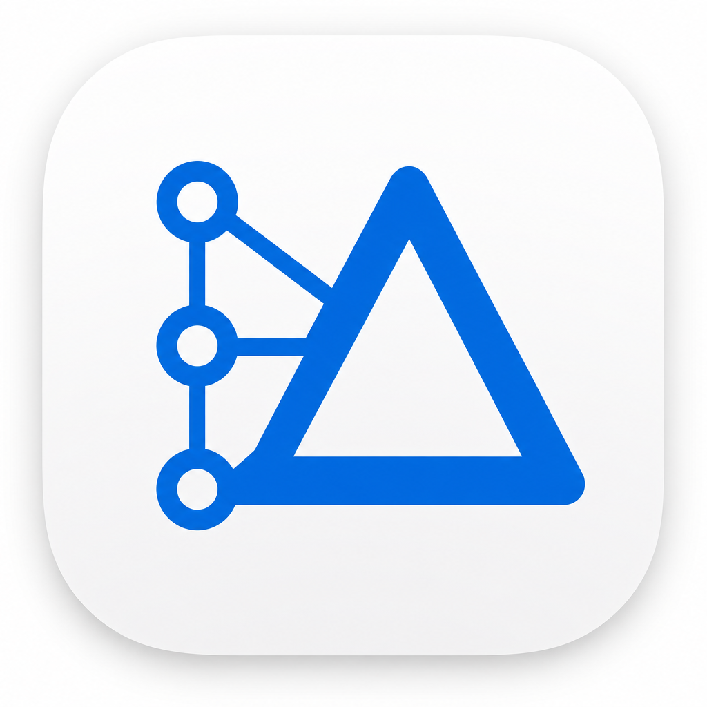
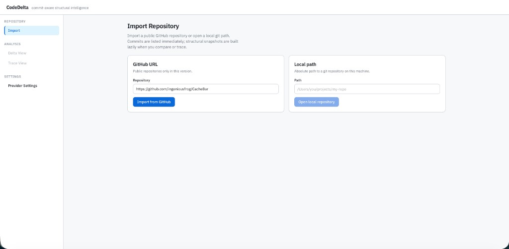
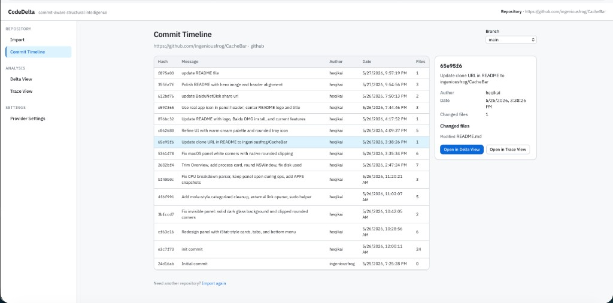
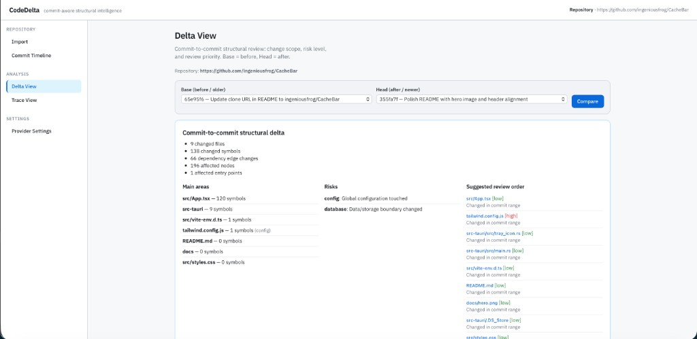
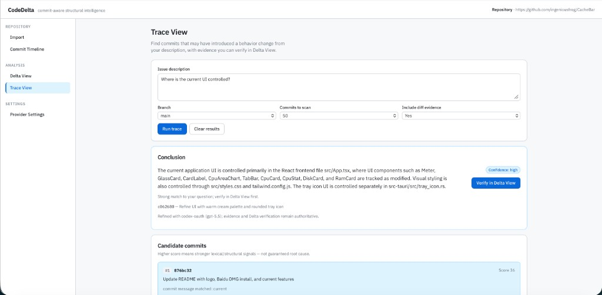

<h1 align="left">
  
  CodeDelta
</h1>

**Local-first, commit-aware structural code intelligence** — built on [CodeGraph](https://github.com/colbymchenry/codegraph).

CodeDelta shows how a codebase’s **structure** changes between commits: symbols, dependency edges, blast radius, and review-oriented summaries. **Trace View** helps narrow down which commit may have introduced a behavior change, with evidence you can verify in **Delta View**. **Panorama** visualizes call-flow trees at a single commit (or a structural diff overlay between two commits).

This repository is a fork: the **CodeGraph** engine lives under [`src/`](src/) (CLI + MCP + tree-sitter graph). The **CodeDelta** app lives under [`packages/`](packages/) and [`apps/web/`](apps/web/) (import, timeline, delta, trace, settings UI).

## How CodeDelta differs from CodeGraph and Understand Anything

| | **CodeGraph** | **CodeDelta** | **Understand Anything** |
|---|---------------|---------------|-------------------------|
| **Primary question** | What is the structure *now*? Who calls whom? | How did structure *change* between two commits? Which commit likely introduced a shift? | What does this repo *mean*? How do I onboard onto it? |
| **Unit of work** | Current workspace / indexed tree | `base commit → head commit` (+ commit-history trace) | Whole repo (or docs) snapshot |
| **Output** | MCP tools, callers/callees, context for agents | Delta summary, impact score, file diff, trace candidates + evidence | Interactive graph dashboard, tours, plain-English node summaries |
| **Analysis** | Deterministic tree-sitter graph (SQLite) | Same graph **per commit snapshot**, then structural diff | Multi-agent pipeline + LLM-enriched graph (`.understand-anything/`) |
| **AI role** | Optional (agent uses graph via MCP) | Optional for Trace (deterministic path always works) | Central to explanations and tours |
| **Best for** | Day-to-day coding agents, refactors, “where is X?” | Release review, regressions, “when did this behavior start?” | Greenfield onboarding, architecture exploration |

**Use together:** CodeGraph (or CodeDelta’s embedded engine) for **live** structure; CodeDelta when you care about **history and commit-level risk**; Understand Anything when you need a **guided map of the whole repo** for humans joining the project — not a substitute for commit-to-commit structural delta.

## Features

### Delta View

Compare two commits (`Base` = before, `Head` = after):

- Changed symbols (functions, classes, components, routes)
- Added/removed dependency edges (`calls`, `imports`)
- Affected nodes from graph traversal
- Deterministic impact score with severity and explanation
- Delta summary (main areas, risks, suggested review order)
- File-level unified diff modal (click files or symbols)
- Per-snapshot metadata (`codegraph` vs `fallback` extraction)
- **Graph tab** — React Flow call tree at the head commit with added/modified/removed coloring on nodes and edges

### Panorama

Interactive call-flow graph from CodeGraph snapshots (React Flow):

- **Single commit** — top entry routes/components/exported symbols, expandable by call depth
- **Branch + commit** selectors; auto-rebuild when either changes
- **Drill-down** — *Expand from here*, breadcrumb trail, Back / All entry points
- **Shareable URLs** — `?branch=&commit=&depth=&focusPath=` preserves your drill-down path
- **Export** — SVG (vector) or hi-DPI PNG generated from graph data (not a DOM screenshot)
- Optional LLM node labels (non-authoritative)
- Linked from **Delta View → Graph**, **Trace View**, and **Commit Timeline**

### Trace View

Describe a bug, behavior change, or question in natural language:

- Rank candidate commits from history (messages, paths, symbols, delta signals)
- Attach evidence per candidate (`previous → candidate` compare when a parent exists)
- Return a direct answer, confidence, uncertainty, and suggested next steps
- Jump to Delta View to verify each candidate
- **View in Panorama** on a candidate commit (trace symbol highlights when available)

**Without any LLM configured**, Trace still returns candidates, evidence, and impact radius (evidence-first, no invented facts).

### Commit timeline & import

- Import a public GitHub repo (`owner/repo` or URL) or a **local git path**
- Browse commits; open Delta, Trace, or Panorama from the timeline

## What CodeDelta is not

- **Not a generic Git GUI** — no merge UI or branch workflow
- **Not a CodeWiki / doc generator** — no long-form auto-docs for the whole repo
- **Not a line-diff-first tool** — structural delta is the product; text diff supports review
- **Not a replacement for Understand Anything** — no interactive whole-repo onboarding graph or LLM tours

## Quick start

Requires **Node.js 20–24** and **git**.

```bash
git clone https://github.com/ingeniousfrog/CodeDelta.git
cd CodeDelta
npm install
npm run build:codedelta
npm run dev:codedelta
```

Open [http://localhost:5173](http://localhost:5173).

1. **Import** a repository (GitHub URL or local path)
2. **Commit Timeline** — pick a branch and browse history
3. **Delta View** — choose `Base (before)` and `Head (after)`, then compare
4. **Trace View** — describe an issue; review candidates and open Delta to verify
5. **Panorama** — pick branch/commit and explore call trees; drill down from any entry or route

## UI walkthrough

### 1) Import repository



### 2) Commit timeline



### 3) Delta View (structural compare)



### 4) Trace View (evidence-first origin analysis)



File-level modal details are also captured in:
[`docs/images/delta-file-diff-modal.png`](docs/images/delta-file-diff-modal.png)

API: [http://localhost:3847](http://localhost:3847)

| Endpoint | Description |
|----------|-------------|
| `GET /api/health` | Health check |
| `GET /api/repos/:id/compare?base=&head=` | Structural delta between commits |
| `GET /api/repos/:id/panorama?commit=&depth=&root=` | Call-flow graph at one commit |
| `GET /api/repos/:id/panorama?base=&head=&depth=` | Delta-colored call-flow graph (head commit tree) |
| `POST /api/repos/:id/panorama/enrich` | Optional LLM labels for panorama nodes |
| `GET /api/repos/:id/diff?base=&head=&file=` | Unified diff for one file |
| `POST /api/repos/:id/trace` | Trace question → candidates + evidence |
| `GET /api/settings/provider` | Current LLM provider settings |
| `GET /api/settings/provider/codex-status` | Local Codex CLI login status |

## Configure Codex for Trace View (optional)

CodeDelta can reuse your **existing Codex CLI login** — no API key pasted into the web UI.

### 1. Log in with Codex CLI

```bash
# Install Codex CLI if needed: https://github.com/openai/codex
codex login
```

This creates or updates `~/.codex/auth.json` (ChatGPT OAuth). You can override the directory with `CODEX_HOME`.

### 2. Select Codex in CodeDelta

1. Open the app → **Settings → Provider Settings**
2. Choose **Codex OAuth**
3. Confirm the page shows that local login was detected (path under `~/.codex/`)
4. **Model** — leave empty to use `model` from `~/.codex/config.toml`, or override (e.g. `gpt-5.5`)
5. **Save settings**

### 3. Run Trace

Open **Trace View**, enter a concrete question (file paths, symbols, or config names help), and click **Run trace**.

Deterministic results always appear; if Codex is configured, the model may refine the narrative. Model output is **non-authoritative** — evidence and Delta verification are the source of truth.

### Codex troubleshooting

| Symptom | What to try |
|---------|-------------|
| “auth.json not found” | Run `codex login` on the same machine as the CodeDelta server |
| `HTTP 400` / unsupported parameter | Restart `npm run dev:codedelta` after pulling latest (Codex backend ≠ OpenAI API) |
| `fetch failed` / timeout | Check network/VPN; retry; see error details for `ENOTFOUND` / `ETIMEDOUT` |
| AI box red but candidates look fine | Expected fallback — structural trace still works; fix Codex and rerun |
| Changes to provider code not applied | `dev:codedelta` rebuilds packages on start; restart the dev server |

**Other providers:** **No AI** (default), **OpenAI API key**, or **OpenAI-compatible** base URL + key. Anthropic and Ollama are not implemented yet.

## Local cache (`.codedelta/`)

| Path | Purpose |
|------|---------|
| `.codedelta/repos/<id>/` | Cloned or referenced repositories |
| `.codedelta/registry.json` | Import registry |
| `.codedelta/snapshots/<repoId>/<hash>/<analyzerVersion>/` | Per-commit structural snapshots |
| `.codedelta/settings.json` | Provider settings |

Snapshots are built **lazily** on compare/trace — full history is not pre-indexed.

## Extraction

**Primary:** CodeGraph (`index` + `exportGraph`) in an isolated git worktree per commit.

**Fallback:** Minimal TS/JS extractor if CodeGraph fails; snapshots record `extractionMethod: "fallback"` and warnings.

## Built on CodeGraph

The [`src/`](src/) tree is the upstream CodeGraph project:

- Tree-sitter → SQLite knowledge graph
- CLI: `codegraph init`, `codegraph sync`, `codegraph serve --mcp`
- MCP tools for agents (search, callers, callees, trace, impact)

Initialize CodeGraph in a repo when you also want agent-time MCP (separate from the CodeDelta web app):

```bash
npm run build
npx codegraph init -i
```

## Project layout

```
src/                          # CodeGraph core (upstream-compatible)
packages/
  codedelta-types/
  codedelta-repo-manager/
  codedelta-server/           # REST API
  codedelta-snapshot-manager/
  codedelta-graph-diff/
  codedelta-graph-subgraph/   # Panorama call-tree + layout
  codedelta-impact-score/
  codedelta-delta-summary/
  codedelta-trace-engine/
  codedelta-provider-runtime/
apps/web/                     # React UI (Delta, Trace, Panorama)
apps/desktop/                 # macOS desktop shell (Tauri 2)
```

Roadmap and deferred work: [docs/codedelta/ROADMAP.md](docs/codedelta/ROADMAP.md).

## Limitations

- TypeScript/JavaScript-first practical path today
- Delta and trace: **commit-to-commit** only (no PR/branch/working-tree compare yet)
- Codex: local CLI session only (no in-browser OAuth)
- Panorama overview shows **top entry surfaces** only on large repos — drill down with *Expand from here*; sparse graphs often mean mount points (`USE /api/*`) need expansion to see router internals
- Panorama export is a simplified card layout (no live *Expand* buttons); prefer **SVG** for zoom/clarity
- Symbol click opens **file** diff, not symbol-to-hunk mapping

## Desktop (macOS)

CodeDelta ships a **macOS desktop app** ([`apps/desktop/`](apps/desktop/)) — a Tauri 2 shell that bundles Node 22 (for CodeGraph’s `node:sqlite`) and the API server. End users do not need a separate Node install.

### Download (Apple Silicon)

Pre-built **unsigned** `.dmg` (arm64 / M1–M4):

- [百度网盘](https://pan.baidu.com/s/1FQxOgNHyvU1Y5EB34RpogQ?pwd=frog) · 提取码: `frog`

Install: open the dmg → drag **CodeDelta** to Applications. If macOS blocks launch, right-click the app → **Open**, or run `xattr -cr /Applications/CodeDelta.app` (common after Baidu Netdisk download). Requires **git** on `PATH`.

**Runtime data:** `~/Library/Application Support/CodeDelta` (repos, snapshots, settings).

### Build from source

**Requirements:** macOS (arm64 or x64), [Xcode Command Line Tools](https://developer.apple.com/xcode/resources/), [Rust 1.88+](https://rustup.rs/) via `rustup` (Homebrew `cargo` alone may be too old), and repo dev dependencies (`npm ci`).

```bash
# One-time: stage embedded Node + server runtime (~200MB under apps/desktop/src-tauri/resources/runtime/)
npm run stage:desktop

# Build .app + .dmg (unsigned; Gatekeeper may prompt on first open)
npm run build:desktop

# Dev: API + Vite + Tauri window (uses localhost:5173 + :3847, not bundled runtime)
npm run dev:desktop
```

Output: `apps/desktop/src-tauri/target/release/bundle/dmg/CodeDelta_*_aarch64.dmg` (or copy to `release/` manually if `bundle_dmg.sh` fails).

**`apps/desktop/` layout:**

```
apps/desktop/
  package.json              # tauri dev / build:app scripts
  src-tauri/
    tauri.conf.json         # window, bundle, embedded resources
    src/server.rs           # spawn bundled Node API on launch
    resources/runtime/      # generated by npm run stage:desktop (gitignored)
```

**Git:** the app shows a banner if `git` is missing.

| Variable | Desktop default | Meaning |
|----------|-----------------|---------|
| `CODEDELTA_CACHE_DIR` | `~/Library/Application Support/CodeDelta` | Cache root (set by Tauri) |
| `CODEDELTA_MONOREPO_ROOT` | bundled `runtime/app` | CodeGraph dist root |
| `CODEDELTA_STATIC_DIR` | bundled `runtime/web-dist` | Web UI static files |
| `CODEDELTA_DESKTOP` | `1` | Desktop mode flag |

## Development

```bash
npm run build:codedelta
npm run dev:codedelta    # API :3847, web :5173, watches provider-runtime

npm test -- packages/codedelta-graph-diff packages/codedelta-graph-subgraph \
  packages/codedelta-impact-score packages/codedelta-server \
  packages/codedelta-snapshot-manager packages/codedelta-trace-engine \
  packages/codedelta-provider-runtime __tests__/codedelta
```

Environment variables:

| Variable | Default | Meaning |
|----------|---------|---------|
| `CODEDELTA_CACHE_DIR` | `.codedelta/` | Cache root |
| `CODEDELTA_PORT` | `3847` | API port |
| `CODEDELTA_MONOREPO_ROOT` | (monorepo root) | CodeGraph dist root; required for desktop bundle |
| `CODEDELTA_STATIC_DIR` | — | Serve web UI from this directory (desktop production) |
| `CODEDELTA_DESKTOP` | — | When `1`, default cache dir on macOS is Application Support |
| `CODEDELTA_SNAPSHOT_TIMEOUT_MS` | `120000` | Snapshot build timeout |
| `CODEDELTA_SNAPSHOT_MAX_NODES` | `50000` | Snapshot node cap |

## License

MIT — see [LICENSE](LICENSE).

This repository combines:

- **CodeGraph** (`src/`, CLI, MCP): Copyright (c) 2026 [Colby Mchenry](https://github.com/colbymchenry). Upstream: [@colbymchenry/codegraph](https://github.com/colbymchenry/codegraph).
- **CodeDelta** (`packages/*`, `apps/web/`): Copyright (c) 2026 [ingeniousfrog](https://github.com/ingeniousfrog) and contributors.

Both parts are licensed under the same MIT terms. Redistributions should retain the copyright notice in `LICENSE`.
