<div align="center">

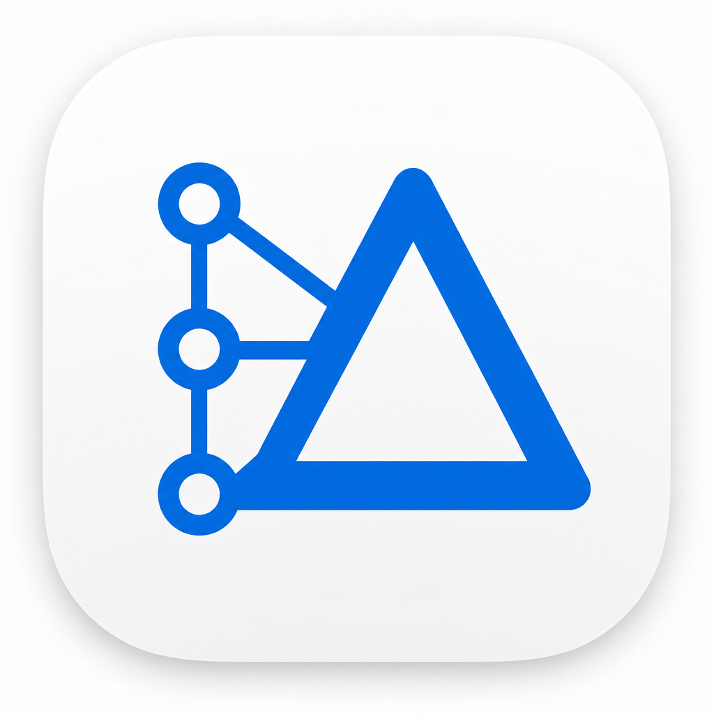

# CodeDelta

**本地优先、commit 感知的结构化代码智能**

基于 [CodeGraph](https://github.com/colbymchenry/codegraph) · commit 级 diff、追溯、全景图、Wiki 与训练数据导出

<br/>

[](https://github.com/ingeniousfrog/CodeDelta/actions/workflows/desktop-macos.yml)
[](https://github.com/ingeniousfrog/CodeDelta/actions/workflows/desktop-windows.yml)
[](https://github.com/ingeniousfrog/CodeDelta/releases)


<br/>

[⬇ 下载](#桌面版macos-与-windows) · [⚡ 快速开始](#快速开始) · [📖 English](README.md)

<br/>

[English](README.md) · **简体中文**

</div>

---

CodeDelta 回答 **「这个代码库是如何随时间演变的？」**：在每个 commit 上构建确定性的结构图，再基于该图做 diff、追溯、可视化、文档生成与训练数据导出 —— 而不是仅依赖行级 diff 或文本分块 RAG。

| | 能力 | 你能得到什么 |
|:--:|------|-------------|
| Δ | **[Delta View](#delta-view)** | 两个 commit 间的结构对比：符号、边、影响范围、冲击分数、文件 diff |
| 🔍 | **[Trace View](#trace-view)** | 自然语言提问 → 排序后的候选 commit + 可验证证据 |
| ◎ | **[Panorama](#panorama)** | 单 commit 交互式调用流图（或两 commit 间的 delta 着色叠加） |
| 📄 | **[Wiki](#wiki-基于结构图的文档--ask)** | 按 commit 的文档、来自真实图边的 Mermaid、可选 LLM 叙述、**Ask this repo** |
| 🧠 | **[Training Data](#training-data-训练数据导出)** | 将 commit 历史导出为 SFT/DPO/RL 数据集（canonical、Alpaca、ShareGPT、DPO、RL） |

本仓库为 fork：**CodeGraph** 引擎在 [`src/`](src/)（CLI + MCP + tree-sitter 图）。**CodeDelta** 应用在 [`packages/`](packages/) 与 [`apps/web/`](apps/web/)（导入、时间线、delta、trace、panorama、wiki、训练数据、设置 UI）。

## 架构

### 产品流程

各视图如何围绕同一仓库及其 commit 历史协作：

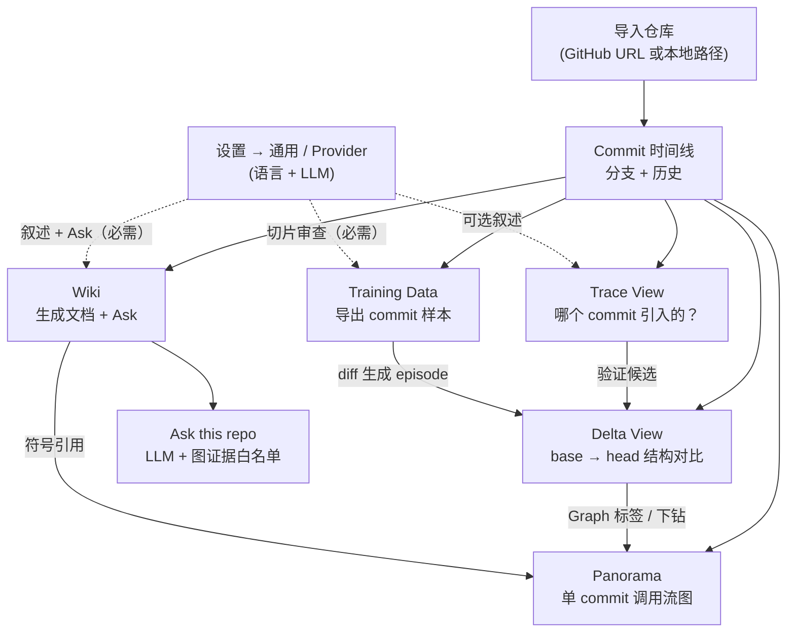

### 项目结构（技术）

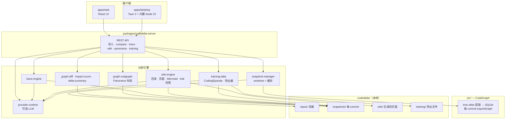

Wiki 生成借鉴 [DeepWiki](https://github.com/AsyncFuncAI/deepwiki-open)，但采用 **图 grounding**：目录、图表与引用来自 CodeGraph 快照；LLM 仅在固定证据白名单之上添加叙述段落与 Ask 回答（不编造符号或边）。

## 与 CodeGraph、Understand Anything 的区别

| | **CodeGraph** | **CodeDelta** | **Understand Anything** |
|---|---------------|---------------|-------------------------|
| **核心问题** | 当前结构是什么？谁调用谁？ | 两个 commit 之间结构如何变化？哪个 commit 可能引入了变化？ | 这个仓库在讲什么？如何上手？ |
| **工作单元** | 当前工作区 / 已索引树 | `base commit → head commit`（+ 历史 trace） | 整库（或文档）快照 |
| **输出** | MCP 工具、callers/callees、agent 上下文 | Delta 摘要、冲击分数、文件 diff、trace 候选 + 证据、**按 commit 的 Wiki + Ask**、**训练数据集** | 交互式全库图、导览、节点 plain-English 摘要 |
| **分析方式** | 确定性 tree-sitter 图（SQLite） | 每 commit 快照上的同一套图，再做结构 diff | 多 agent 流水线 + LLM enriched 图 |
| **AI 角色** | 可选（agent 经 MCP 用图） | Trace 可选；Wiki Ask 与 Training 导出切片审查需 LLM | 解释与导览的核心 |
| **最适合** | 日常编码 agent、重构、「X 在哪？」 | 发版审查、回归、「行为从哪次 commit 开始变？」 | 新人 onboarding、架构探索 |

**组合使用：** CodeGraph（或 CodeDelta 内置引擎）看 **实时** 结构；CodeDelta 关注 **历史与 commit 级风险**；Understand Anything 适合 **整库导览** —— 不能替代 commit 间的结构 delta。

## 功能

### Delta View

对比两个 commit（`Base` = 之前，`Head` = 之后）：

- 变更符号（函数、类、组件、路由）
- 新增/删除的依赖边（`calls`、`imports`）
- 图遍历得到的影响节点
- 确定性冲击分数（严重度 + 说明）
- Delta 摘要（主要变更区域、风险、建议审查顺序）
- 文件级 unified diff 弹窗（点击文件或符号）
- 每快照元数据（`codegraph` vs `fallback` 提取）
- **Graph 标签** — head commit 上的 React Flow 调用树，节点/边按增删改着色

### Panorama

基于 CodeGraph 快照的交互式调用流图（React Flow）：

- **单 commit** — 顶层入口路由/组件/导出符号，按调用深度展开
- **分支 + commit** 选择器；变更时自动重建
- **下钻** — *从此处展开*、面包屑、返回 / 全部入口
- **可分享 URL** — `?branch=&commit=&depth=&focusPath=` 保留下钻路径
- **导出** — 由图数据生成 SVG 或高 DPI PNG（非 DOM 截图）
- 可选 LLM 节点标签（非权威）
- 可从 **Delta View → Graph**、**Trace View**、**Commit 时间线** 进入

### Trace View

用自然语言描述 bug、行为变化或问题：

- 从历史中排序候选 commit（message、路径、符号、delta 信号）
- 每个候选附带证据（有父 commit 时做 `previous → candidate` 对比）
- 返回直接回答、置信度、不确定性与建议下一步
- 跳转 Delta View 验证每个候选
- 在候选 commit 上 **在 Panorama 中查看**（有 trace 符号时可高亮）

**未配置任何 LLM** 时，Trace 仍返回候选、证据与影响范围（证据优先，不编造事实）。

### Wiki（基于结构图的文档 + Ask）

从 commit 时间线（或 `/repos/:id/wiki`）打开 **Wiki**。选择 commit → **Generate wiki** → 浏览目录、阅读页面，在侧栏使用 **Ask this repo**。

借鉴 [DeepWiki](https://github.com/AsyncFuncAI/deepwiki-open)，但基于 **CodeGraph 快照**，而非对原始文件的 embedding/RAG：

| 层级 | 是否需要 LLM | 内容 |
|------|-------------|------|
| **结构** | 否 | 目录（概览、架构、顶层模块、路由/组件）、符号表、文件列表、README 摘录 |
| **图表** | 否 | Mermaid 模块 import 图与调用流 — **来自真实边序列化**，不由模型编造 |
| **叙述** | 可选 | 配置 Provider 后每页 prose（显示 “with LLM narration”） |
| **Ask** | **是** | 对话式问答；词法 + 图检索 → 证据白名单 → 带引用的 LLM 回答 |

- **引用** 链接到符号的文件/行范围；符号引用可在对应 commit 打开 **Panorama**
- **Ask** 在问题无法匹配符号时，用入口点 + README 引导 LLM
- 缓存于 `.codedelta/wiki/<repoId>/<hash>/<wikiVersion>/`；生成为带进度的后台任务
- 引擎：[`packages/codedelta-wiki-engine/`](packages/codedelta-wiki-engine/)

### Training Data（训练数据导出）

从导航栏打开 **Training Data**（或 `/repos/:id/training`）。将 commit 历史转为 **CodingEpisode** 记录 —— 基于真实 diff 与图上下文的结构化 instruction/patch 对，再导出为训练数据集。

| 模式 | 说明 |
|------|------|
| **Range** | 在分支上选择 **Before** 与 **After** commit，导出其间每个 parent→child 区间 |
| **History** | 遍历近期分支历史，可配置过滤器（跳过 merge、仅文档、超大 diff 等） |

| 格式 | 用途 |
|------|------|
| `canonical` | CodeDelta `CodingEpisode` JSONL（schema `codedelta.coding_episode.v1`） |
| `alpaca` | instruction / input / output，用于监督微调 |
| `sharegpt` | 多轮 `conversations` JSONL |
| `dpo` | chosen/rejected 对，用于偏好对齐 |
| `rl` | RL 流水线任务清单 |

- **必须配置 LLM Provider** —— 模型审查每个 commit 区间并将 diff 切分为可训练切片（不适合时会记录跳过原因）
- 调用模型前有确定性预过滤（仅 lockfile、仅格式化、仅重命名等）
- 后台任务带进度；完成后可下载产物
- 缓存于 `.codedelta/training/<repoId>/exports/<exportId>/`
- 引擎：[`packages/codedelta-training-data/`](packages/codedelta-training-data/)

### Commit 时间线与导入

- 导入公开 GitHub 仓库（`owner/repo` 或 URL）或 **本地 git 路径**
- 浏览 commit；从时间线 / 导航打开 Delta、Trace、Panorama、Wiki 或 Training Data

## CodeDelta 不是什么

- **不是通用 Git GUI** — 无 merge UI 或分支工作流
- **不是行 diff 优先工具** — 结构 delta 是产品核心；文本 diff 辅助审查
- **不能替代 Understand Anything** — 无整库 onboarding 交互图或 LLM 导览

## 快速开始

需要 **Node.js 20–24** 与 **git**。

```bash
git clone https://github.com/ingeniousfrog/CodeDelta.git
cd CodeDelta
npm install
npm run build:codedelta
npm run dev:codedelta
```

打开 [http://localhost:3847](http://localhost:3847)（开发模式将 Vite UI 代理到 API 端口；[http://localhost:5173](http://localhost:5173) 也可用）。

1. **导入** 仓库（GitHub URL 或本地路径）
2. **Commit 时间线** — 选分支并浏览历史
3. **Delta View** — 选择 `Base (before)` 与 `Head (after)` 后对比
4. **Trace View** — 描述问题；查看候选并在 Delta 中验证
5. **Panorama** — 选分支/commit 探索调用树；从任意入口或路由下钻
6. **Wiki** — 选 commit、生成 wiki、浏览页面，并用带引用的 Ask 提问
7. **Training Data** — 导出 commit 区间或分支历史为 SFT/DPO/RL 数据集（需配置 Provider）
8. **设置 → 通用** — 切换界面语言（English / 简体中文）；Wiki 正文按语言分别生成与缓存

## 界面导览

以下截图为 **桌面版 v0.2.3**（Analysis 导航含 Delta、Trace、Panorama、Wiki、Training Data；设置含通用与模型提供方）。展示宽度已限制，便于阅读；点击图片可查看原图。

### 1) 导入仓库

<p align="center">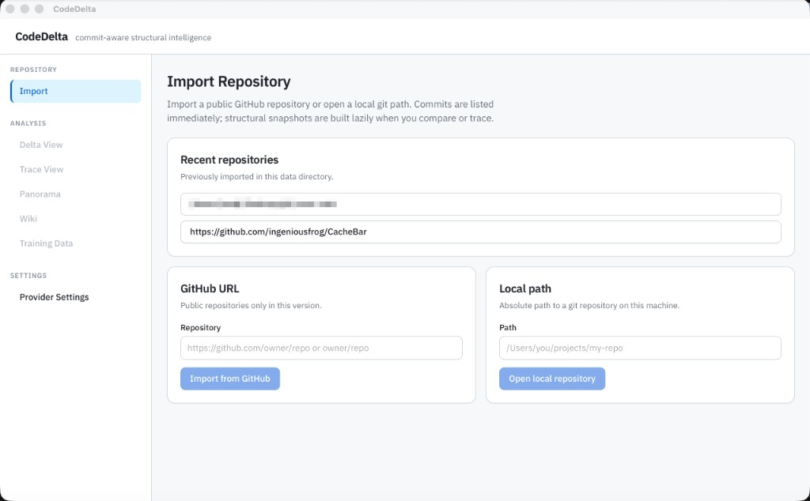</p>

### 2) Commit 时间线与导航

浏览分支历史；导入仓库后，侧栏可进入各分析视图。

<p align="center">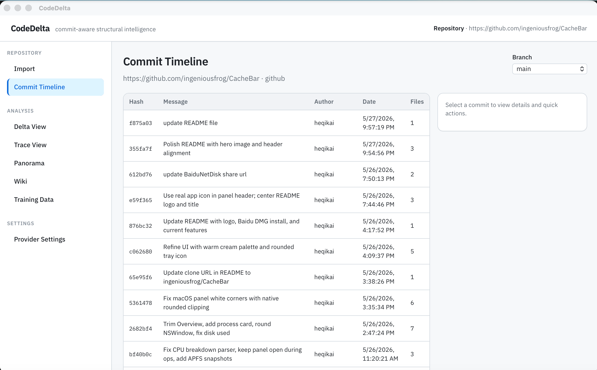</p>

### 3) Delta View（结构对比）

<p align="center">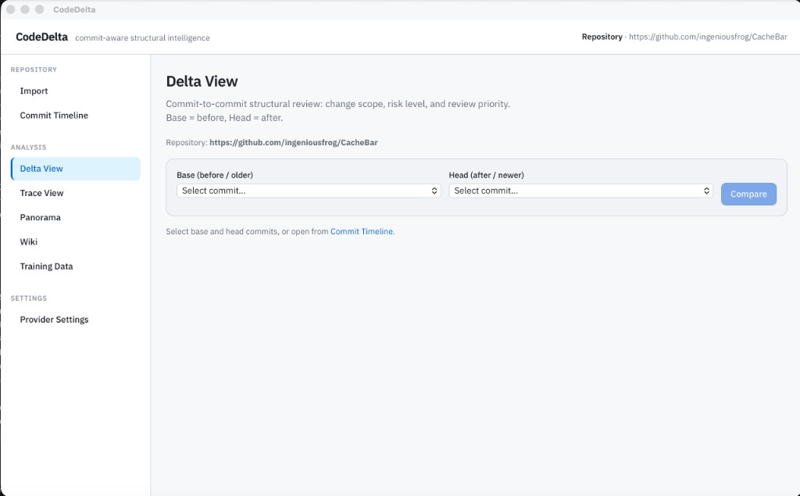</p>

### 4) Trace View（证据优先的来源分析）

<p align="center">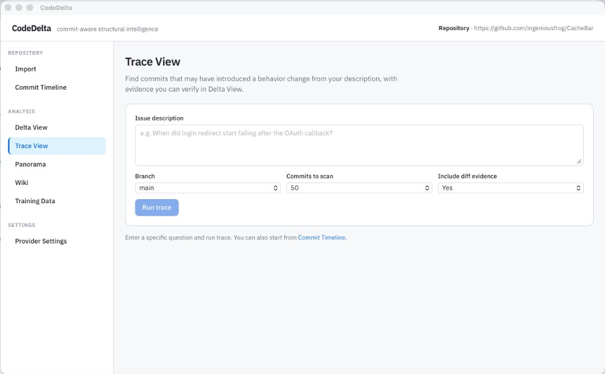</p>

### 5) Panorama（调用流图）

<p align="center">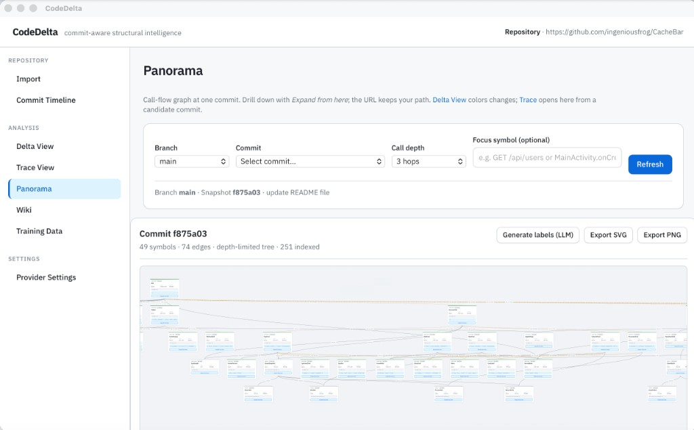</p>

### 6) Wiki（基于结构图的文档 + Ask）

<p align="center">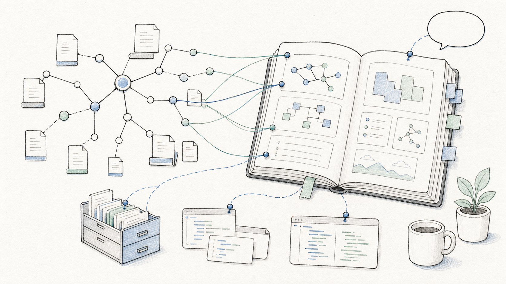</p>

### 7) Training Data（导出 SFT / DPO / RL 数据集）

<p align="center">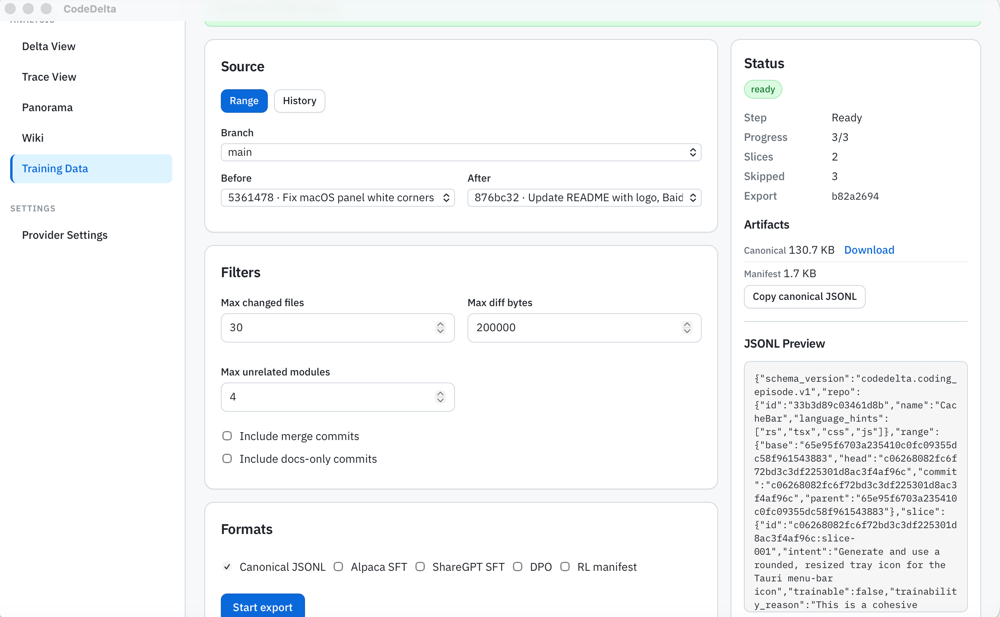</p>

文件级弹窗示例：
<p align="center">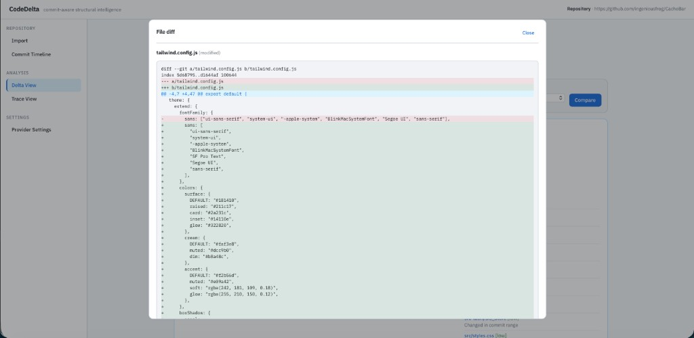</p>

API：[http://localhost:3847](http://localhost:3847)

| 端点 | 说明 |
|------|------|
| `GET /api/health` | 健康检查 |
| `GET /api/repos/:id/compare?base=&head=` | 两 commit 间结构 delta |
| `GET /api/repos/:id/panorama?commit=&depth=&root=` | 单 commit 调用流图 |
| `GET /api/repos/:id/panorama?base=&head=&depth=` | Delta 着色调用流图（head 树） |
| `POST /api/repos/:id/panorama/enrich` | 可选 LLM 节点标签 |
| `GET /api/repos/:id/diff?base=&head=&file=` | 单文件 unified diff |
| `POST /api/repos/:id/trace` | Trace 问题 → 候选 + 证据 |
| `POST /api/repos/:id/wiki/generate?commit=&locale=` | 开始 wiki 生成（后台任务；`locale` = `en` \| `zh-Hans`） |
| `GET /api/repos/:id/wiki/status?commit=&locale=` | 生成状态与进度 |
| `GET /api/repos/:id/wiki/toc?commit=&locale=` | Wiki 目录 |
| `GET /api/repos/:id/wiki/page?commit=&section=&locale=` | 单页（markdown + 引用） |
| `GET /api/repos/:id/wiki/asset?commit=&path=` | commit 上的 README / wiki 图片 |
| `POST /api/repos/:id/wiki/ask` | 问题 → 带引用回答（`body.locale` 选择回答语言） |
| `POST /api/repos/:id/training/export` | 开始训练数据导出（后台任务） |
| `GET /api/repos/:id/training/exports/:exportId/status` | 导出任务状态与进度 |
| `GET /api/repos/:id/training/exports/:exportId/artifacts` | 列出生成的文件 |
| `GET /api/repos/:id/training/exports/:exportId/download?format=` | 下载 JSONL / manifest |
| `GET /api/settings/provider` | 当前 LLM Provider 设置 |
| `GET /api/settings/provider/codex-status` | 本机 Codex CLI 登录状态 |

## 为 Trace、Wiki 与 Training 配置 Codex（可选）

CodeDelta 可复用 **已有 Codex CLI 登录** —— 无需在 Web UI 粘贴 API Key。

### 1. 使用 Codex CLI 登录

```bash
# 如未安装：https://github.com/openai/codex
codex login
```

会在 `~/.codex/auth.json` 创建或更新 ChatGPT OAuth。可用 `CODEX_HOME` 覆盖目录。

### 2. 在 CodeDelta 中选择 Codex

1. 打开应用 → **Settings → Provider Settings**
2. 选择 **Codex OAuth**
3. 确认页面显示已检测到本机登录（`~/.codex/` 下路径）
4. **Model** — 留空则使用 `~/.codex/config.toml` 中的 `model`，或覆盖（如 `gpt-5.5`）
5. **Save settings**

### 界面语言（English / 简体中文）

打开 **设置 → 通用**，选择 **EN** 或 **中文**。偏好保存在浏览器 `localStorage`，立即作用于导航、页面文案与表单。

**Wiki** 页面与 **Ask** 回答跟随同一语言：切换语言会使用独立 wiki 缓存，若该语言尚未生成，需重新点「生成 Wiki」。确定性章节（目录标题、表格等）会即时本地化；LLM 叙述需已配置 Provider。

### 3. 运行 Trace

打开 **Trace View**，输入具体问题（文件路径、符号名、配置名更有帮助），点击 **Run trace**。

确定性结果始终会出现；若已配置 Codex，模型可能润色叙述。模型输出 **非权威** —— 以证据与 Delta 验证为准。同一 Provider 也用于 **Wiki** 页面叙述与 **Ask**（Ask 必须配置 Provider；无 LLM 时 wiki 页面仍可生成结构化内容），以及 **Training Data** 导出切片审查（必须配置 Provider）。

### Codex 故障排查

| 现象 | 处理 |
|------|------|
| “auth.json not found” | 在与 CodeDelta 服务同一机器上运行 `codex login` |
| `HTTP 400` / 不支持的参数 | 拉取最新代码后重启 `npm run dev:codedelta`（Codex 后端 ≠ OpenAI API） |
| `fetch failed` / 超时 | 检查网络/VPN；查看 `ENOTFOUND` / `ETIMEDOUT` |
| AI 区域报错但候选正常 | 预期回退 —— 结构 trace 仍可用；修复 Codex 后重试 |
| 改了 Provider 代码未生效 | `dev:codedelta` 启动时会 rebuild 包；重启 dev server |

**其他 Provider：** **No AI**（默认）、**OpenAI API key**、或 **OpenAI 兼容** base URL + key。Anthropic 与 Ollama 尚未实现。

## 本地缓存（`.codedelta/`）

| 路径 | 用途 |
|------|------|
| `.codedelta/repos/<id>/` | 克隆或引用的仓库 |
| `.codedelta/registry.json` | 导入注册表 |
| `.codedelta/snapshots/<repoId>/<hash>/<analyzerVersion>/` | 每 commit 结构快照 |
| `.codedelta/wiki/<repoId>/<hash>/<wikiVersion>/` | 生成的 wiki（目录、页面、元数据） |
| `.codedelta/training/<repoId>/exports/<exportId>/` | 训练数据导出产物与 manifest |
| `.codedelta/settings.json` | Provider 设置 |

快照在 compare/trace 时 **懒构建** —— 不会预索引全部历史。

## 提取

**主路径：** 每 commit 在隔离 git worktree 中运行 CodeGraph（`index` + `exportGraph`）。

**回退：** CodeGraph 失败时使用最小 TS/JS 提取器；快照记录 `extractionMethod: "fallback"` 与警告。

## 基于 CodeGraph

[`src/`](src/) 为上游 CodeGraph 项目：

- Tree-sitter → SQLite 知识图
- CLI：`codegraph init`、`codegraph sync`、`codegraph serve --mcp`
- 面向 agent 的 MCP 工具（search、callers、callees、trace、impact）

若还需 agent 运行时 MCP（与 CodeDelta Web 应用独立），可在目标仓库初始化 CodeGraph：

```bash
npm run build
npx codegraph init -i
```

## 项目目录

```
src/                          # CodeGraph 核心（与上游兼容）
packages/
  codedelta-types/
  codedelta-repo-manager/
  codedelta-server/           # REST API
  codedelta-snapshot-manager/
  codedelta-graph-diff/
  codedelta-graph-subgraph/   # Panorama 调用树 + 布局
  codedelta-impact-score/
  codedelta-delta-summary/
  codedelta-trace-engine/
  codedelta-wiki-engine/      # Wiki 目录/页面/Mermaid + Ask 检索
  codedelta-training-data/    # CodingEpisode 导出 + 数据集序列化
  codedelta-provider-runtime/
apps/web/                     # React UI（Delta、Trace、Panorama、Wiki、Training）
apps/desktop/                 # macOS / Windows 桌面壳（Tauri 2）
```

路线图与待定项：[docs/codedelta/ROADMAP.md](docs/codedelta/ROADMAP.md)。

## 限制

- 当前实践路径以 TypeScript/JavaScript 为主
- Delta 与 trace：**仅 commit 对 commit**（尚无 PR/分支/工作区对比）
- Codex：仅本机 CLI 会话（无浏览器内 OAuth）
- Panorama 概览在大仓库上只显示 **顶层入口面** —— 用 *从此处展开* 下钻；稀疏图常因挂载点（`USE /api/*`）需展开才能看到路由内部
- Panorama 导出为简化卡片布局（无 live *Expand*）；缩放/clarity 优先 **SVG**
- 点击符号打开 **文件** diff，非符号到 hunk 的精确映射

## 桌面版（macOS 与 Windows）

CodeDelta 提供 **桌面应用**（[`apps/desktop/`](apps/desktop/)）— Tauri 2 壳，内置 Node 22（供 CodeGraph `node:sqlite`）与 API 服务。终端用户无需单独安装 Node。

**版本** 来自 `apps/desktop/src-tauri/tauri.conf.json`（当前 **0.2.3**）。macOS 与 Windows 安装包发布在同一 GitHub Release：[`codedelta-desktop-v0.2.3`](https://github.com/ingeniousfrog/CodeDelta/releases/tag/codedelta-desktop-v0.2.3)。桌面版包含 **Delta、Trace、Panorama、Wiki 与 Training Data**，以及 **EN / 简体中文** 界面（Wiki Ask 与 Training 导出需配置 LLM Provider）。

### 下载

| 平台 | 文件 | 说明 |
|------|------|------|
| **macOS**（Apple Silicon） | [GitHub Releases](https://github.com/ingeniousfrog/CodeDelta/releases/tag/codedelta-desktop-v0.2.3) → `CodeDelta_*_aarch64.dmg` | 未签名；若被拦截请右键 → 打开 |
| **Windows**（x64） | [GitHub Releases](https://github.com/ingeniousfrog/CodeDelta/releases/tag/codedelta-desktop-v0.2.3) → `CodeDelta_*_x64-setup.exe` | NSIS 安装包 |
| macOS 镜像 | [百度网盘](https://pan.baidu.com/s/1FQxOgNHyvU1Y5EB34RpogQ?pwd=frog) · 提取码: `frog` | **仅旧版 v0.1.0** — 无 Wiki / Training；请用 [GitHub Releases](https://github.com/ingeniousfrog/CodeDelta/releases/tag/codedelta-desktop-v0.2.3) 获取当前版本 |

**安装（macOS）：** 打开 dmg → 将 **CodeDelta** 拖入「应用程序」。

若从 GitHub/Safari 下载后 macOS 提示 **「已损坏，无法打开」**，这是 Gatekeeper 对未签名应用的隔离 —— 应用本身未损坏。修复：

```bash
xattr -cr /Applications/CodeDelta.app
```

然后重新打开，或首次右键应用 → **打开**。（百度网盘下载也常需同样 `xattr` 步骤。）

**安装（Windows）：** 运行 setup `.exe` 并按向导完成。

两平台均需在 `PATH` 中有 **git**。**请勿在使用已安装应用的同时运行 `npm run dev:desktop`** —— 两者均占用 3847 端口；dev server 仅 API 会导致空白 `Cannot GET /`。

**运行时数据：** macOS `~/Library/Application Support/CodeDelta` · Windows `%APPDATA%\CodeDelta`

### 从源码构建

**要求：** 目标操作系统（macOS 或 Windows）、[Rust 1.88+](https://rustup.rs/)、仓库 dev 依赖（`npm ci`）。macOS 还需 Xcode Command Line Tools；Windows 需 [NSIS](https://nsis.sourceforge.io/)。

```bash
# 一次性：staging 内置 Node + 服务运行时（约 200MB，位于 apps/desktop/src-tauri/resources/runtime/）
npm run stage:desktop

# 构建 .app + .dmg（未签名；首次打开 Gatekeeper 可能提示）
npm run build:desktop

# 开发：API + Vite + Tauri 窗口（localhost:5173 + :3847，非 bundled runtime）
npm run dev:desktop
```

输出：
- macOS：`apps/desktop/src-tauri/target/release/bundle/dmg/CodeDelta_*_aarch64.dmg`
- Windows：`apps/desktop/src-tauri/target/release/bundle/nsis/CodeDelta_*_x64-setup.exe`

**`apps/desktop/` 目录：**

```
apps/desktop/
  package.json              # tauri dev / build:app 脚本
  src-tauri/
    tauri.conf.json         # 窗口、bundle、内置资源
    src/server.rs           # 启动时 spawn bundled Node API
    resources/runtime/      # 由 npm run stage:desktop 生成（gitignore）
```

**Git：** 若缺少 `git`，应用会显示横幅提示。

| 变量 | 桌面版默认 | 含义 |
|------|-----------|------|
| `CODEDELTA_CACHE_DIR` | `~/Library/Application Support/CodeDelta` | 缓存根（Tauri 设置） |
| `CODEDELTA_MONOREPO_ROOT` | bundled `runtime/app` | CodeGraph dist 根 |
| `CODEDELTA_STATIC_DIR` | bundled `runtime/web-dist` | Web UI 静态文件 |
| `CODEDELTA_DESKTOP` | `1` | 桌面模式标志 |

## 开发

```bash
npm run build:codedelta
npm run dev:codedelta    # API :3847，web :5173，watch provider-runtime

npm test -- packages/codedelta-graph-diff packages/codedelta-graph-subgraph \
  packages/codedelta-impact-score packages/codedelta-server \
  packages/codedelta-snapshot-manager packages/codedelta-trace-engine \
  packages/codedelta-wiki-engine packages/codedelta-training-data \
  packages/codedelta-provider-runtime __tests__/codedelta
```

环境变量：

| 变量 | 默认 | 含义 |
|------|------|------|
| `CODEDELTA_CACHE_DIR` | `.codedelta/` | 缓存根 |
| `CODEDELTA_PORT` | `3847` | API 端口 |
| `CODEDELTA_MONOREPO_ROOT` |（monorepo 根）| CodeGraph dist 根；桌面 bundle 必需 |
| `CODEDELTA_STATIC_DIR` | — | 从此目录提供 Web UI（桌面生产环境） |
| `CODEDELTA_DESKTOP` | — | 为 `1` 时 macOS 默认缓存目录为 Application Support |
| `CODEDELTA_SNAPSHOT_TIMEOUT_MS` | `120000` | 快照构建超时 |
| `CODEDELTA_SNAPSHOT_MAX_NODES` | `50000` | 快照节点上限 |

## 许可证

MIT — 见 [LICENSE](LICENSE)。

本仓库包含：

- **CodeGraph**（`src/`、CLI、MCP）：Copyright (c) 2026 [Colby Mchenry](https://github.com/colbymchenry)。上游：[@colbymchenry/codegraph](https://github.com/colbymchenry/codegraph)。
- **CodeDelta**（`packages/*`、`apps/web/`）：Copyright (c) 2026 [ingeniousfrog](https://github.com/ingeniousfrog) 及贡献者。

两部分均遵循相同 MIT 条款。再分发时请保留 `LICENSE` 中的版权声明。
