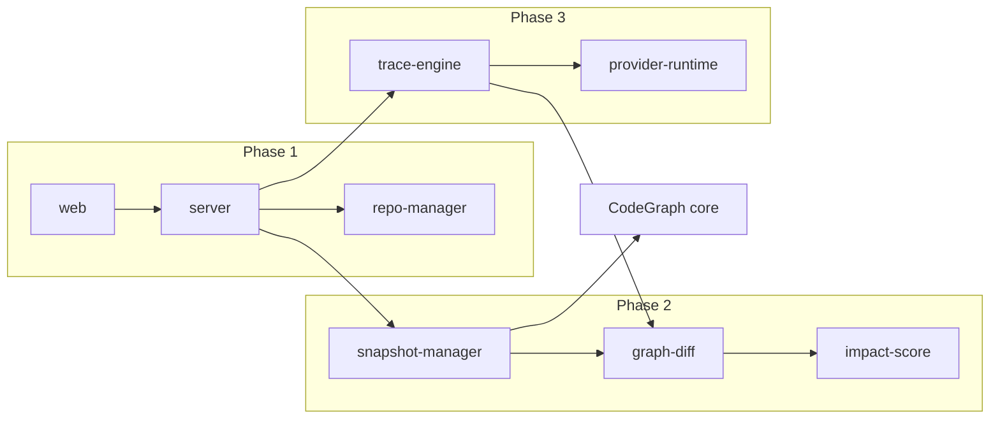

# CodeDelta Roadmap

Phase 1 (current) delivers repository import, commit timeline API, and web UI shell.

## Phase 1 — Foundation ✅

- [x] `@codedelta/types` — shared data models
- [x] `@codedelta/repo-manager` — GitHub clone, local path, commits, changed files
- [x] `@codedelta/server` — REST API + registry persistence
- [x] `@codedelta/web` — Import, Timeline, navigation shells for Delta/Trace/Settings
- [x] Package stubs for Phase 2/3 modules

## Phase 2 — Delta View

- [ ] `CodeGraph.exportGraph()` in core — export nodes/edges/files as JSON snapshot
- [ ] `@codedelta/snapshot-manager` — worktree checkout → index → cache under `.codedelta/snapshots/`
- [ ] `@codedelta/graph-diff` — compare snapshots (added/removed/modified nodes and edges)
- [ ] `@codedelta/impact-score` — score commits from structural change + entry points
- [ ] `POST /api/repos/:id/delta` — full implementation
- [ ] Delta View UI — file tree, changed symbols table, summary panel

### Graph diff matching rules

- **Nodes:** match by `qualifiedName` + `kind`; modified when signature or line range changes
- **Edges:** match by `(source, target, kind)`
- **Affected nodes:** BFS from changed nodes over `calls` and `imports` edges

## Phase 3 — Trace View + Providers

- [ ] `@codedelta/trace-engine` — candidate retrieval + evidence assembly + LLM prompt
- [ ] `@codedelta/provider-runtime` — OpenAI, Anthropic, Ollama, compatible, Codex OAuth
- [ ] `POST /api/repos/:id/trace` — structured `TraceAnswer`
- [ ] Trace View UI — question input, candidate cards, evidence chain, confidence
- [ ] Provider Settings — credential storage in `.codedelta/settings.json`

### Trace principles

- Never invent commits, files, symbols, or behavior
- State confidence and what was checked vs. cannot be confirmed
- No-AI mode: candidate commit list from keyword/file/symbol search only

## Phase 4 — Polish

- [ ] GitHub private repo token support
- [ ] Incremental snapshot indexing (changed files only)
- [ ] `codedelta` CLI — single command to start server + open browser
- [ ] Interactive graph visualization in Delta View
- [ ] Broader language validation beyond TypeScript/JavaScript

## Architecture notes

Cache key for snapshots: `{repoId}/{commitHash}/{analyzerVersion}` where `analyzerVersion` is the CodeGraph package version.
