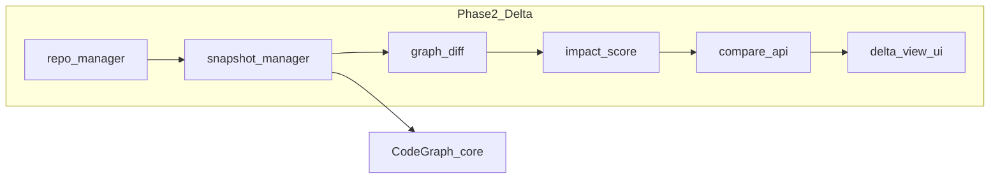

# CodeDelta Roadmap

## Phase 1 — Foundation ✅

- [x] npm workspaces and package layout
- [x] `@codedelta/types`
- [x] `@codedelta/repo-manager`
- [x] `@codedelta/server` import/branches/commits APIs + registry persistence
- [x] `@codedelta/web` import/timeline shell + settings shell
- [x] README repositioning to CodeDelta

## Phase 2 — Delta View Foundation (commit-to-commit) ✅

Implemented in this phase:

- [x] `CodeGraph.exportGraph()` and edge export support
- [x] `@codedelta/snapshot-manager`
  - safe worktree checkout (no active worktree mutation)
  - snapshot cache key: `{repoId}/{commitHash}/{analyzerVersion}`
  - CodeGraph primary path + TS/JS fallback extractor
- [x] `@codedelta/graph-diff`
  - added/removed/modified nodes
  - added/removed edges
  - affected nodes via BFS (`calls`, `imports`)
- [x] `@codedelta/impact-score`
  - deterministic scoring (files, symbols, edges, affected nodes)
  - risk tags (`auth`, `billing`, `database`, `migration`, `env`, `config`, `api`, `routing`, `dependency`)
- [x] Compare API
  - `GET /api/repos/:repoId/compare?base=<hash>&head=<hash>`
  - error mapping for repo/commit/snapshot/timeout/size/unsupported
- [x] Delta View UI first functional version
  - base/head selectors
  - compare with previous commit
  - changed files panel
  - graph diff summary panel
  - impact/risk panel
  - structural node/edge lists
- [x] Timeline integration
  - action: **Compare with previous commit**

### Notes

- `POST /api/repos/:id/delta` is deprecated and now returns guidance to use `GET /compare`.
- Rich graph rendering is intentionally deferred.


## Phase 2.5 — Delta View UX Refinement ✅

Implemented in this phase:

- [x] Deterministic `DeltaSummary` generation
  - changed files/symbols/edges/affected metrics
  - main changed areas/modules
  - risk breakdown with reasons
  - suggested review order
- [x] Impact score explanation
  - severity labels (`low`/`medium`/`high`/`critical`)
  - explanation reasons + top contributors
- [x] File-level diff API
  - `GET /api/repos/:repoId/diff?base=<hash>&head=<hash>&file=<path>`
  - path traversal validation + clear error mapping
  - unified patch + parsed hunks
- [x] Delta View UX reorganization
  - summary-first information hierarchy
  - tabs for files/symbols/edges/metrics
  - changed files and symbols open file diff modal

### Deferred TODOs

- [ ] symbol-to-hunk precise mapping in diff viewer
- [ ] richer graph rendering
- [ ] LLM-assisted summary (optional mode)
- [x] Trace View foundation
- [x] Codex OAuth（本机 `codex login`）

## Current supported DeltaSource

Implemented:

```ts
type DeltaSource = {
  type: 'commit';
  commitHash: string;
  label?: string;
};
```

Not implemented yet (planned):

- `branch`
- `tag`
- `pull_request`
- `working_tree`
- `folder`

## Phase 3 — Trace View + Providers ✅ (foundation)

- [x] `@codedelta/trace-engine` deterministic candidate retrieval + evidence assembly
- [x] `@codedelta/provider-runtime` no-AI fallback + minimal OpenAI/OpenAI-compatible adapter
- [x] `POST /api/repos/:id/trace` production foundation implementation
- [x] Trace View UI first functional version
  - [x] question input / branch / commitLimit / includeDiffEvidence
  - [x] candidate commits with reasons and relevance score
  - [x] evidence panel + impact radius + evolution + uncertainty
  - [x] candidate -> Delta verification navigation (`previous -> candidate`)
- [x] low-history fallback behavior (low confidence + uncertainty guidance)

### Phase 3 deferred TODOs

- [x] Codex OAuth provider（本机 CLI 凭据 + ChatGPT backend）
- [ ] richer provider adapters (Anthropic/Ollama)
- [ ] stronger trace confidence calibration
- [ ] richer graph-backed evidence (deeper call-path reasoning)
- [ ] branch/PR/working-tree/folder trace sources

## Phase 4 — Depth and polish

- [ ] Deeper CodeGraph integration for snapshots (incremental indexing / reuse)
- [ ] Rich graph visualization (React Flow or Cytoscape)
- [ ] Private GitHub repository support
- [ ] Incremental snapshot acceleration for large repositories
- [ ] Timeline-level persisted impact scores
- [ ] Extended DeltaSource variants beyond commits

## Phase Desktop — macOS app (MVP)

- [x] `@codedelta/server` static UI hosting + `CODEDELTA_MONOREPO_ROOT`
- [x] Web boot screen (`/api/health` polling, git banner)
- [x] `scripts/desktop-stage.mjs` — embedded Node 20 + production runtime
- [x] `apps/desktop` Tauri 2 shell (spawn/kill API, single instance, `127.0.0.1:3847`)
- [x] Import page recent repositories
- [x] `npm run dev:desktop` / `stage:desktop` / `build:desktop`
- [ ] Apple code signing + notarization for public distribution
- [ ] Windows / Linux desktop
- [ ] Auto-update, menu bar quick open, drag-and-drop import

## Architecture snapshot



